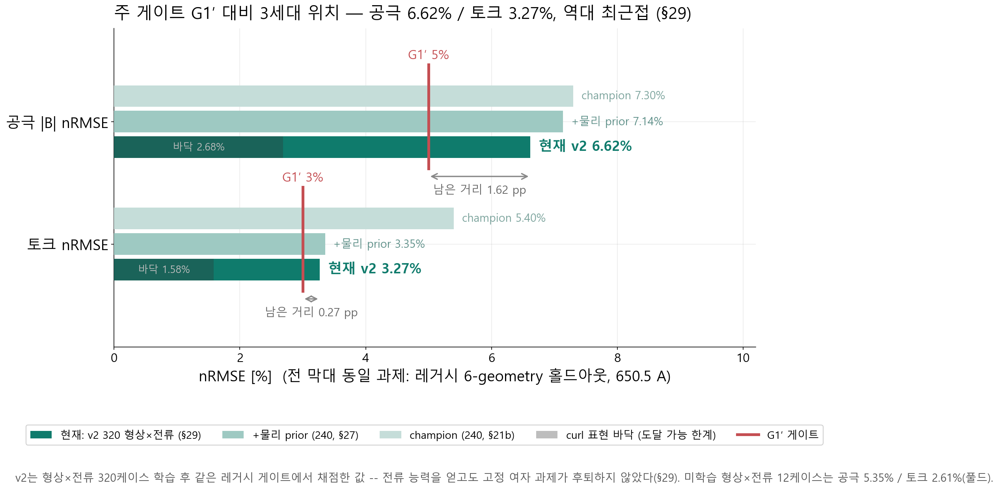
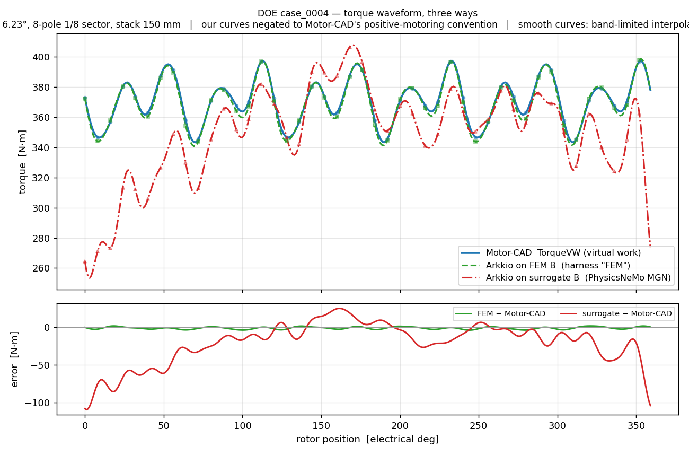
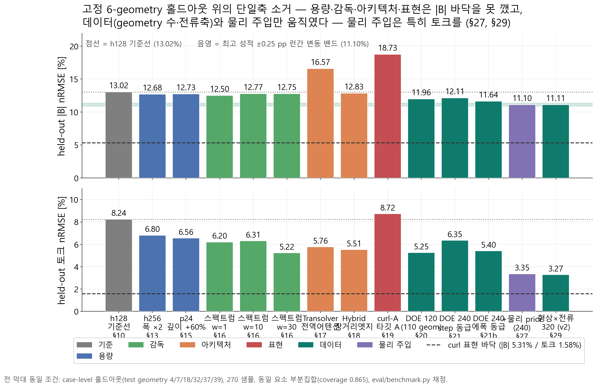
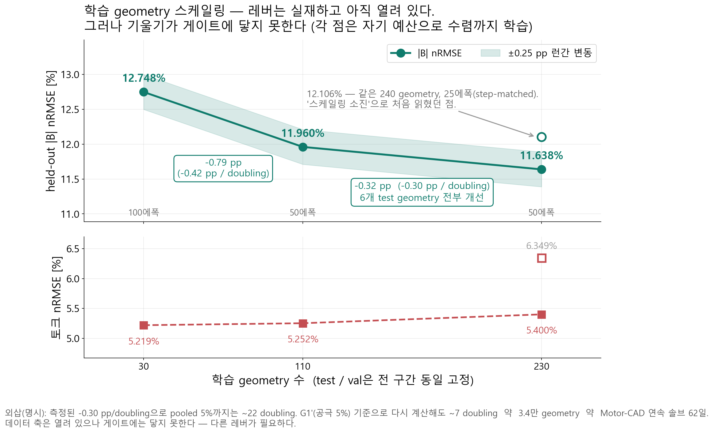
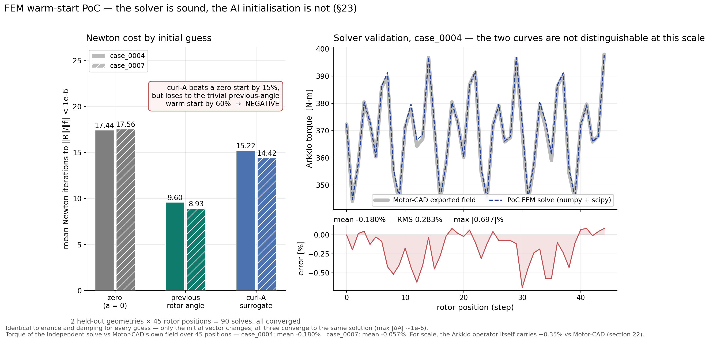

# motorAI — Motor-CAD 해석을 대신하는 AI 모델 만들기

> 사내 세미나 · 2026-08-07 · 발표자 노트 포함 · AI/통계 비전공 대상, 맨 뒤 용어집
> 슬라이드 파일: `motorai_seminar_20260807.pptx` (동일 내용). 이 문서는 `tools/make_seminar_deck.py`가 pptx와 함께 생성하므로 둘은 항상 일치한다.
> 그림은 같은 폴더의 png를 참조한다.

---

## 슬라이드 1 — motorAI — Motor-CAD 해석을 대신하는 AI 모델 만들기

- motorAI — Motor-CAD 해석을 대신하는 AI 모델 만들기

- 지금 어디까지 왔고, 무엇을 고쳐 나가고 있는가

- 현재 성적:  공극 자속밀도 오차 7.14%  ·  토크 오차 3.35%   (학습에 쓰지 않은 시험용 형상 6개 기준)
- 합격 기준(공극 5% · 토크 3%)까지 — 공극 2.14%p, 토크 0.35%p 남았다   ·   낯선 용어는 맨 뒤 용어집 참조

- 사내 세미나 · 2026-08-07

<details>
<summary><b>발표자 노트</b></summary>

오늘은 motorAI 서로게이트가 지금 어떤 상태이고, 무엇을 어떻게 고쳐 나가고 있는지
짧게 공유하겠습니다. 10분 남짓 보시면 됩니다.

한 줄로 먼저 말씀드리면 — Motor-CAD 해석을 대신 계산해 주는 AI 모델을 만들고 있고,
지금 공극 자속밀도 오차 7.14%, 토크 오차 3.35%입니다. 합격선은 5%와 3%입니다.
공극은 아직 2.1%p 남았지만, 토크는 0.35%p까지 붙었습니다.
불과 얼마 전까지 토크가 5.4%였으니 최근에 크게 움직인 겁니다.
무엇이 그걸 움직였고 다음에 뭘 할 건지가 오늘 내용입니다.

</details>

---

## 슬라이드 2 — 한 장 요약 — 상황과 개선 방향

**지금 위치**

- 공극 오차  7.14%   (합격선 5%)
- 토크 오차  3.35%   (합격선 3%)
- 전체 오차  11.10%
- 여러 설계 중 좋은 것 고르기
- (순위 매기기)는 지금도 된다.
- "토크가 정확히 몇 N·m"로
- 쓰기에는 아직 부족하다.

**왜 안 내려가나**

- AI 모델 쪽 개선책은 다 써봤다.
- 크기·학습 방법·구조·출력 방식
- 네 가지를 하나씩 바꿔 실험 —
- 오차 12.7%가 꿈쩍 안 했다.
- 효과가 있던 건 데이터 늘리기
- 하나뿐인데, 그 속도로는
- 합격선까지 60일 넘게 걸린다.

**그래서 한 일과 첫 결과**

- ① 간이 자기해석 결과를 힌트로 입력
- 토크 오차 5.40 → 3.35%
- (미리 정한 1차 기준인 공극은
- 통과 못 함 — 0.09%p 차이)
- ② 지금: 형상×전류 320케이스 학습 중
- 전류축을 처음으로 실제 반영
- ③ 채점·재현 체계는 이미 확보

- 한 문장으로:  모델 키우기는 효과가 없었고 데이터만으로는 너무 오래 걸린다 — 물리 힌트를 넣자 토크가 처음으로 합격선 코앞까지 왔다.

<details>
<summary><b>발표자 노트</b></summary>

결론부터 세 칸으로 요약했습니다.

왼쪽, 지금 위치. 공극 오차 7.14%, 토크 오차 3.35%입니다. 합격선은 5%와 3%.
"오차 7%"는 시험용 형상에서 AI 예측과 FEM 참값의 차이를 참값 크기로 나눈 값입니다.
다만 용도를 나눠서 봐야 합니다. "후보 설계 여럿 중 좋은 것을 골라내는" 용도는
지금 정확도로 이미 됩니다 — 순위가 FEM과 일치합니다. 뒤에 근거를 보여드립니다.
"이 설계의 토크가 몇 N·m이다"라고 정량으로 쓰는 건 아직 안 됩니다.

가운데, 왜 안 내려가느냐. 이게 지난 몇 주의 핵심 결과입니다.
모델을 키우고, 학습 방법을 바꾸고, 구조를 바꾸고, 출력 방식을 바꿨습니다.
한 번에 하나씩만 바꿔서 원인을 특정할 수 있게요. 전부 효과가 없었습니다.
효과가 있던 건 학습 데이터 양 하나뿐인데, 줄어드는 속도가 너무 느려서
그 길로는 합격선까지 못 갑니다.

오른쪽, 그래서 뭘 했고 뭐가 나왔나. 간이 자기해석(선형 계산) 결과를
AI 입력에 힌트로 넣었습니다. 토크가 5.40에서 3.35%로 움직였습니다.
합격선 3%까지 0.35%p 남았습니다.
다만 정직하게 말씀드리면, 결과를 보기 전에 정해둔 1차 판정 기준은 공극이었고
그 기준은 통과하지 못했습니다. 공극 7.138%인데 기준이 7.05% 미만이었습니다.
0.09%p 차이인데, 이 정도는 학습을 다시 돌릴 때마다 생기는 우연 변동 폭 안이라
"넘었다"고 주장할 수 없습니다. 그래서 "1차 기준은 미달, 토크는 크게 개선" —
두 사실을 그대로 같이 보고합니다.

지금은 형상에 전류축을 더한 320케이스 학습이 돌고 있습니다.

한 문장으로 줄이면 아래 박스입니다.

</details>

---

## 슬라이드 3 — 무엇을 만들고 있나

*배경*

**① 데이터**

- Motor-CAD v261
- 48슬롯/8극 IPM
- 1/8 반주기 섹터
- 45자세 회전 스윕
- 1케이스 ≈ 160초

**② 그래프**

- 메시를 그대로 입력:
- 점 = 메시 절점
- 선 = 요소 변
- 형상마다 메시가 달라
- 격자식 AI는 못 쓴다

**③ AI 모델**

- 메시 그래프 신경망
- 각 절점이 이웃과
- 15회 정보를 주고받으며
- 자기 값을 갱신
- 출력 = 절점의 B

**④ 채점**

- |B| 오차율(nRMSE)
- Arkkio 공극 토크
- 영역별로 나눠 채점
- 시험 형상은 학습에서
- 완전히 분리

- 설계 탐색(DOE)은 FEA 호출 수천~수만 회. 우리 DOE를 +120케이스 늘리는 데만 5~6시간이 들었다
- AI가 밀리초에 장을 내주면, 후보 걸러내기는 AI에 맡기고 상위 후보만 FEM으로 확인하면 된다
- 처음부터 지킨 원칙: 필드 오차에서 멈추지 않고 공극의 자기응력을 적분(Arkkio법)해 토크까지 채점한다 — 설계자가 실제로 보는 숫자로 판정하기 위해

<details>
<summary><b>발표자 노트</b></summary>

배경을 짧게 짚고 가겠습니다.

Motor-CAD로 IPM 한 케이스를 45개 회전 자세까지 풀면 160초 정도 걸립니다.
설계 공간을 훑으려면 이걸 수천 번 해야 하니 감당이 안 됩니다.
저희 DOE를 120케이스 늘리는 데만 대여섯 시간 걸렸습니다.

그래서 대신 계산해 주는 AI를 학습시킵니다. 메시를 점과 선의 그래프로 바꿔서 넣습니다.
왜 이 방식이냐 하면, 형상이 바뀌면 메시가 통째로 달라지기 때문입니다.
사진처럼 규칙적인 격자를 전제하는 AI로는 IPM 형상을 담을 수가 없습니다.
모델은 MeshGraphNet인데, 개념적으로는 각 절점이 이웃과 열다섯 번 정보를 주고받으면서
자기 값을 갱신하는 구조입니다. FEM이 국소 결합으로 푸는 것과 닮았습니다.

마지막 항목이 저희가 처음부터 잡고 간 원칙입니다.
보통 이런 연구는 필드 오차 수치만 보고합니다. 그런데 설계자가 보는 건 토크입니다.
그래서 저희는 AI가 내놓은 장에 공극 응력 적분(Arkkio법)을 걸어 토크까지 계산해서 판정합니다.

</details>

---

## 슬라이드 4 — 지금 성적 — 합격 기준까지 남은 거리

*상황*  ·  근거 `§25 §27`



**물리 힌트를 넣자 토크 오차 5.40 → 3.35% — 합격 기준 두 항목 중 하나가 사정권(0.35%p)에 들어온 것은 이번이 처음이다**

- 다만 결과를 보기 전에 정해둔 1차 기준은 공극이었고, 통과하지 못했다 — 7.138%로 기준 7.05%에 0.09%p 못 미침(우연 변동 폭 안). 두 사실을 같이 보고한다
- 이 계산 방식이 낼 수 있는 최저 오차(한계선)는 공극 2.68%다. 현재 7.14%와는 4.5%p 차이 — 방식의 한계가 아니라 학습이 아직 못 따라간 것이므로 공략할 여지가 실제로 있다

<details>
<summary><b>발표자 노트</b></summary>

지금 성적입니다. 연한 막대가 직전 최고 모델, 진한 막대가 현재 모델,
빨간 선이 합격선, 제일 진한 부분이 이 방식으로 도달 가능한 최저 오차입니다.

좋은 소식부터. 토크 오차가 5.40에서 3.35%로 내려왔습니다. 합격선 3%까지 0.35%p 남았습니다.
합격 기준 두 항목 중 하나가 사정권에 들어온 건 이번이 처음입니다.
특히 데이터를 두 배로 늘려도 토크는 0.08%p밖에 안 움직여서 그 길은 막혔다고 봤었는데,
물리 힌트는 한 번에 2%p를 움직였습니다.

그런데 정직하게 말씀드릴 게 있습니다. 결과를 보기 전에 정해둔 1차 판정 기준은
토크가 아니라 공극이었습니다. 공극은 7.138%가 나왔고 기준이 7.05% 미만이었습니다.
0.09%p 차이로 못 넘었습니다. 이 정도 차이는 같은 학습을 다시 돌릴 때마다 생기는
우연 변동 폭 안이라 "넘었다"고 주장할 수 없습니다. 그래서 1차 기준은 미달입니다.
기준을 미리 적어놨기 때문에, 결과를 보고 유리한 지표로 갈아타는 일 없이
이렇게 그대로 보고할 수 있습니다. 그게 이 기준의 존재 이유입니다.

세 번째 줄이 다음 작업의 근거입니다. 이 계산 방식의 한계선 — FEM 참값을 우리 방식으로
옮겨 적기만 해도 남는 오차 — 이 공극 2.68%입니다.
지금 7.14%라는 건 방식의 한계에 막힌 게 아니라 학습이 아직 못 따라간 겁니다.
4.5%p 여유가 실제로 있으니 여기가 공략 지점입니다.

</details>

---

## 슬라이드 5 — 예측 장이 실제로 어떻게 생겼나 — |B| 컨투어

*상황*  ·  근거 `case 4 / step 10`


*행마다 FEM 참값 · AI 예측 · 차이(예측−FEM). 공극을 따라가는 흰 호는 오차가 아니라 회전 자세마다 다시 만들어지는 요소(슬라이딩 밴드)라 그리지 않은 것. 패널 제목의 %는 시험 형상 전체 집계값이지 이 한 장면의 오차가 아니다.*

<details>
<summary><b>발표자 노트</b></summary>

숫자만 보시면 감이 안 오실 것 같아 실제 장을 띄웠습니다. test 케이스 4번, 회전 10번째 자세입니다.

행마다 왼쪽이 FEM 참값, 가운데가 서로게이트 예측, 오른쪽이 차이입니다.
윗줄이 이전 챔피언, 아랫줄이 물리 prior를 넣은 현재 모델입니다.

보시면 전체적인 자속 분포 — 자석에서 나와 회전자 철심을 지나 공극을 건너
고정자 치로 들어가는 경로 — 는 왼쪽과 가운데가 눈으로 구분이 안 됩니다.

차이 패널을 보면 오차가 어디 있는지 드러납니다.
매끈한 요크나 자석 내부처럼 장이 완만한 곳은 거의 흰색이고,
슬롯과 권선 영역, 자석·치 경계처럼 형상이 급하게 꺾이는 곳에 얼룩이 몰려 있습니다.
아까 영역별 표에서 권선이 40%, 공극이 7%였던 게 그림으로는 이렇게 보입니다.

공극을 따라 흰 호가 지나가는데 저건 오차가 아닙니다. 슬라이딩 밴드 요소입니다.
회전 자세마다 연결성이 바뀌어서 유효한 형상이 없기 때문에 아예 안 그립니다.
1만3천 요소 중 1만1천6백 개만 그려진 이유가 그겁니다.

한 가지 주의드리면, 패널 제목의 퍼센트는 시험 형상 전체 집계값입니다.
이 한 장면의 오차가 아닙니다. 그림과 숫자를 섞어 읽지 않도록 라벨에 명시해뒀습니다.

</details>

---

## 슬라이드 6 — 같은 케이스를 한 바퀴 돌려보면 — 애니메이션

*상황*  ·  근거 `case 4 / 45자세`


*슬라이드쇼 모드에서 자동 재생. 아래 토크 곡선의 매끈한 선은 45개 계산점을 수학적으로 복원한 실제 파형이고(§28), 점이 실제 계산 위치다. 리플 봉우리가 높낮이를 번갈아 12개 — 이 기계의 지배 리플은 12차(슬롯 고조파, 6차의 1.6~2.1배)다.*

<details>
<summary><b>발표자 노트</b></summary>

방금 그 케이스를 한 전기 주기, 45개 회전 자세로 돌린 애니메이션입니다.
왼쪽부터 FEM 참값, AI 예측, 차이입니다. 아래는 토크 파형이고 세로선이 현재 자세입니다.

회전자가 돌면서 자속 경로가 바뀌는 걸 AI가 자세마다 따라가는 게 보입니다.

토크 곡선 하나만 짚고 가겠습니다. 봉우리를 세보시면 높은 것 낮은 것이 번갈아 12개입니다.
3상 기계니까 6개 아니냐고 하실 수 있는데, 이 기계는 슬롯 고조파(12차)가
6차보다 1.6~2.1배 커서 12개가 맞습니다. 저희도 처음에 6개를 기대하고 파형이 지저분하다고
생각했다가, 주파수 분석으로 확인하고서야 이게 정상 파형이라는 걸 알았습니다.

</details>

---

## 슬라이드 7 — 토크 파형 — 계산기 검증과 AI 성능을 한 장에서

*상황*  ·  근거 `§8c §22`



**세 곡선이 말하는 것**

- 파랑 = Motor-CAD가 직접 계산한 토크 (기준)
- 초록 = FEM이 푼 장에 우리 토크 계산기(Arkkio 적분)를 적용. 기준과 겹쳐서 구분이 안 된다 — 평균 차이 0.35%, 토크 계산기 자체가 맞다는 검증
- 빨강 = AI가 예측한 장에 같은 계산기를 적용. 기준과의 간격이 곧 AI의 오차다
- 평균과 리플의 큰 흐름은 따라가지만 일부 구간에서 눈에 띄게 벗어난다 — 아래 오차 패널이 그 구간을 보여준다
- 시험 형상 전체로 집계한 토크 오차율은 3.354% (§27)

<details>
<summary><b>발표자 노트</b></summary>

토크 파형입니다. 이 그림 한 장에 두 가지가 같이 들어 있습니다.

파란색이 Motor-CAD가 자체 방식(가상일법)으로 계산한 토크입니다. 이게 기준입니다.
두 번째 곡선은 FEM이 푼 장에 우리 토크 계산기(Arkkio 적분)를 걸어서 나온 토크입니다.
이 둘의 차이가 평균 0.35%입니다. 즉 우리 토크 계산기 자체가 맞다는 뜻입니다.
이게 없으면 "AI 토크 오차 3.35%"라는 말이 의미가 없습니다.
계산기가 틀렸을 가능성을 먼저 지워야 하니까요.

빨간색이 AI가 예측한 장에 같은 계산기를 건 결과입니다.
그러니까 기준선과 빨간 선 사이의 간격이 순수하게 모델 탓입니다.

여기는 정직하게 봐주셔야 합니다. 평균 수준과 리플의 큰 주기는 따라갑니다.
슬롯 통과로 생기는 골짜기 위치는 대체로 맞습니다.
그런데 아래 오차 패널을 보시면, 구간에 따라 오차가 확 커지는 데가 있습니다.
전기각 230도에서 280도 사이가 특히 그렇습니다. 여기서 리플 진폭을 과대예측합니다.
평균만 맞춘 건 아니지만, 파형을 그대로 쓸 수 있는 수준도 아직 아닙니다.

test 전체로 집계한 토크 오차가 3.354%인데, 이 그림은 그 숫자가 한 케이스에서
어떤 모양으로 나타나는지를 보여주는 겁니다.
NVH까지 보시려면 이 빨간 곡선이 초록색만큼 붙어야 하고, 그게 남은 과제입니다.

참고로 이 검증 수치는 한 번 정정된 적이 있습니다. 문서에 0.60%로 적혀 있었는데
어느 커밋된 아티팩트에서도 재현이 안 돼서 재유도했고, 재현되는 값은 0.35%입니다.

</details>

---

## 슬라이드 8 — AI 모델 쪽 개선책은 다 써봤다 — 하나씩 바꾼 실험

*진단*  ·  근거 `§13 §15-21b`



*각 막대는 직전 구성에서 딱 한 가지만 바꾼 결과 — 시험 문제도 채점 방식도 동일. 데이터 늘리기(청록)만 오차를 낮췄다.*

<details>
<summary><b>발표자 노트</b></summary>

이게 진단의 근거입니다. 캠페인 전체를 한 장에 담았습니다.
위가 필드 오차, 아래가 토크 오차. 왼쪽에서 오른쪽으로 시간 순서고,
각 막대는 바로 앞 구성에서 딱 한 가지만 바꾼 겁니다.
바꿔본 네 가지는 앞 요약과 같은 이름으로: 크기, 학습 방법, 구조, 출력 방식입니다.

파란색은 모델 크기입니다. 모델 내부의 조절 가능한 숫자(파라미터)를 230만 개에서
930만 개로 4배 키웠는데 13.0에서 12.7 — 같은 학습을 다시 돌릴 때 생기는
우연 변동 폭(0.25%p) 안이라 효과가 없는 겁니다. 층을 깊게 해도 마찬가지입니다.

초록색은 학습 방법 — 무엇을 맞히도록 채점할지를 바꾼 실험입니다.
필드 오차는 평탄합니다. 다만 토크는 움직였습니다 — 이건 뒤에 나옵니다.

주황색은 모델 구조. 멀리 떨어진 절점끼리도 직접 정보를 주고받게 하는 구조를
넣었더니 16.6%로 오히려 나빠졌고, 먼 절점을 직접 잇는 연결선을 추가해도 제자리입니다.

빨간색은 출력 방식. 18.7%로 크게 나빠졌습니다.

그리고 오른쪽 끝 청록색이 데이터입니다. 학습 형상 수를 늘렸더니 처음으로 바닥이 깨졌습니다.

솔직히 말씀드리면 앞의 네 가지는 전부 효과가 없었습니다. 실험의 상당수가 실패였습니다.
그런데 이 실패들이 "막힌 곳은 모델이 아니라 데이터, 즉 정보다"라는 진단을 만들어줬습니다.
하나씩 지워보지 않았으면 지금 물리 힌트로 가는 근거가 없었을 겁니다.

</details>

---

## 슬라이드 9 — 데이터 늘리기는 통한다 — 그러나 너무 느리다

*진단*  ·  근거 `§20 §21b §21c`



**읽는 법**

- 학습 형상 40 → 120 → 240에서 오차 12.75 → 11.96 → 11.64%
- 시험 형상 6개 전부, 매 단계 개선 — 한 케이스가 평균을 끄는 게 아니다
- 속 빈 점: 같은 데이터를 학습 횟수 절반으로 돌린 결과. '한계에 닿았다'고 잘못 읽을 뻔한 지점 → 학습을 충분히 시키니 회복됐다
- 합격 기준 항목인 공극 오차는 데이터 두 배당 0.32%p씩 줄어든다(§25). 이 속도로 공극 5%까지 가려면 형상 약 3.4만 개 = Motor-CAD 62일 연속 계산
- → 데이터 늘리기는 유효하지만, 현실적 비용 안에서는 합격선에 못 닿는다

<details>
<summary><b>발표자 노트</b></summary>

데이터 축을 자세히 보겠습니다.

학습 형상을 40, 120, 240으로 늘리면 필드 오차가 12.75에서 11.64%까지 내려갑니다.
개선이 광범위합니다 — 6개 평가 형상이 전부, 매 단계마다 좋아집니다.
한 케이스가 평균을 끌고 가는 게 아닙니다.

속이 빈 동그라미를 봐주십시오. 여기에 배울 점이 있습니다.
저건 처음 나온 240 결과인데, 데이터를 두 배로 늘렸는데 안 내려갔습니다.
그래서 "데이터를 늘려도 더는 안 좋아지는 한계에 닿았다"고 판정했었습니다.
원인은 총 계산 시간을 같게 맞추려고 반복 학습 횟수를 절반으로 줄인 것이었습니다.
데이터가 두 배면 반복도 두 배가 필요한데, 데이터당 학습량을 반토막 낸 겁니다.
다시 돌리니 11.638%가 나왔습니다. 한계에 닿은 게 아니라 학습이 부족했던 겁니다.
판정 기준을 미리 적어두고 실험했기 때문에 사후 해석 없이 뒤집을 수 있었습니다.

그런데 마지막 두 줄이 문제입니다. 합격 기준 항목인 공극 오차 기준으로,
줄어드는 속도가 데이터 두 배당 0.32%p입니다.
이 속도로 공극 5%까지 가려면 형상이 3만 4천 개 필요하고, Motor-CAD를 62일 연속 돌려야 합니다.
현실적으로 안 됩니다. 그래서 다른 레버가 필요하다는 결론이 나온 겁니다.

</details>

---

## 슬라이드 10 — 이 숫자를 믿을 수 있는 이유

*근거*  ·  근거 `§7-9 §22`

**'컨닝'을 세 번 잡아냈다**

- 시험 답이 학습에 새어 들어가면
- 성적이 가짜로 좋아진다(누수).
- 예: time_s라는 입력이 회전자각과
- 완전히 같은 정보(상관 1.0000)였는데
- AI가 이걸 주 단서로 삼았다.
- 이 값 하나만 바꾸니 토크 예측이
- −264 → +48로 부호까지 뒤집혔다.
- 제거하고 시험 문제를 형상 단위로
- 분리하자 모델들의 순위가 다 바뀌었다.

**방식의 한계선을 먼저 쟀다**

- FEM 참값을 우리 계산 방식으로
- 옮겨 적기만 해도 남는 오차 =
- 어떤 학습으로도 못 넘는 한계선.
- 절점 평균 방식  |B| 16.98%  토크 59.5%
- curl 방식      |B| 5.31%  토크 1.58%
- 방식만 바꿔도 토크 한계가 37배 갈린다.
- AI를 탓하기 전에 이것부터 잰다.

**토크 계산기를 검증했다**

- 우리 Arkkio 적분 vs Motor-CAD의
- 자체 계산, 한 주기 전체 대조:
- 평균 토크 차이      0.35%
- 자세별 차이(RMS)   0.54%
- 파형 상관계수      0.9955
- 재현성: 같은 채점을 3회 반복해
- 바이트까지 동일한 결과 확인.

*평가 체계를 먼저 세운 것이 이 캠페인의 차별점이다 — 이게 없었다면 위의 소거 결론 자체를 신뢰할 수 없다.*

<details>
<summary><b>발표자 노트</b></summary>

"그 숫자들을 왜 믿느냐"에 대한 답입니다. 짧게 세 가지만.

첫째, 컨닝을 잡았습니다. time_s라는 입력값이 있었는데,
저희 DOE는 전 케이스가 같은 속도라 이게 회전자각과 완전히 같은 정보였습니다
(상관계수 1.0000 — 두 값이 완벽히 같이 움직인다는 뜻).
독립 정보가 하나도 없는 중복 입력인데 AI가 이걸 주 단서로 학습했습니다.
이 값만 바꿔서 다시 예측시키니 토크가 −264에서 +48로 부호까지 뒤집혔습니다.
제거하고 홀드아웃을 케이스 단위로 바꾸니 그때까지 비교하던 모든 모델의 순위가 바뀌었습니다.
즉 그 전의 비교는 전부 무의미했습니다. 필드 오차만 봤으면 못 잡았을 겁니다.

둘째, 표현 바닥값입니다. 성능이 안 나올 때 모델을 탓하기 전에,
참값을 그 출력 표현으로 한 번 왕복시켜 보면 도달 불가능한 하한이 나옵니다.
절점 왕복 방식은 토크 바닥이 59%입니다. 쓸 수가 없죠.
이산 curl은 1.6%입니다. 표현만 바꿔도 37배 차이가 납니다.

셋째, 토크 계산기 자체를 Motor-CAD와 대조했습니다. 평균 차이 0.35%,
파형 상관계수 0.9955 — 두 곡선이 거의 같은 모양으로 움직인다는 뜻입니다.
그래서 토크를 1급 지표로 쓸 수 있는 겁니다.

이 세 가지가 없었으면 앞에서 보여드린 소거 결론을 저희 스스로도 못 믿습니다.

</details>

---

## 슬라이드 11 — 최근 발견 — DOE 전류축이 솔브에 전달되지 않았다

*개선 항목*  ·  근거 `§24 §26`

**발견 — export된 전류밀도 감사**

```text
case  6   Ipk  18.18 A   →  A-turns 325.24
case  4   Ipk 224.05 A   →  A-turns 325.27
case 17   Ipk 646.33 A   →  A-turns 325.19
```

- Ipk가 35배 변하는 동안 여자는 0.03% 안에서 동일하다.

**루트 코즈 — 인과 솔브 2회로 확정**

- 전 케이스가 RMS 전류 모드로 설정돼 있었다
- 그 모드에서 PeakCurrent는 솔브 입력이 아니라 파생 표시량
- PeakCurrent 224→100 : 토크 무반응 (소수 4자리까지)
- RMSCurrent 460→230 : 토크 −43% ← 이게 진짜 입력

**함의와 대응**

- 전 케이스가 같은 여자 수준에서 풀렸다 → 학습 데이터에 포화 다양성이 0이다
- 배포 시 '전류를 바꾸면 예측이 따라온다'는 기대는 틀린다 — 모델은 전류 의존성을 본 적이 없다
- 형상 스케일링 결론은 불변 — 그 축은 실제로 전달됐다. 오늘 보여드린 곡선은 그대로 선다
- 대응: 전류 입력 모드 수정 + '바꾼 변수가 실제로 필드에 도달했는가'를 검사하는 자동 검문을 데이터 생성 절차에 상설화

<details>
<summary><b>발표자 노트</b></summary>

이번 주에 나온 발견입니다. 유쾌하진 않지만 그래서 더 공유드려야 합니다.

저희 DOE는 4축이라고 알고 있었습니다. 형상 둘, 위상 진각, 그리고 피크 전류.
그런데 export된 전류밀도를 감사해보니 도체 암페어-턴이 전 케이스에서 325로 상수였습니다.
피크 전류가 18A인 케이스나 646A인 케이스나 여자가 같습니다. 35배 차이나는데 0.03% 안에서 동일합니다.

원인은 확정했습니다. 파일이 전부 RMS 전류 모드였고, 그 모드에서 PeakCurrent는
솔브 입력이 아니라 화면 표시용 파생값입니다. DOE가 표시값만 열심히 바꾸고 있었던 거죠.

문서만 보고 판단하지 않고 원본 사본으로 인과 솔브를 두 번 돌렸습니다.
PeakCurrent를 바꾸면 토크가 소수 넷째 자리까지 안 움직이고,
RMSCurrent를 바꾸면 43% 떨어집니다. 확정입니다.

함의는 나눠서 봐야 합니다.
나쁜 소식은 학습 데이터에 포화 다양성이 없다는 겁니다. 전부 같은 여자에서 풀렸습니다.
그래서 배포할 때 전류 의존성을 기대하면 안 됩니다. 모델이 본 적이 없으니까요.
좋은 소식은 형상 축은 제대로 전달됐다는 겁니다. 오늘 보여드린 스케일링 결론은 안 흔들립니다.

대응은 두 가지입니다. 전류 입력 모드를 고치고,
"바꾼 변수가 실제로 필드에 도달했는지"를 자동 검사하는 검문을 데이터 생성 절차에
상설화합니다. 이번에 이걸 잡은 감사 절차 자체가 재사용 가능한 자산입니다.

</details>

---

## 슬라이드 12 — 개선 경로

*다음*

**① 물리 힌트 입력 — 완료**

- 간이 선형 자기해석을 절점마다 미리
- 계산해 AI 입력에 넣는다. AI는 장 전체가
- 아니라 '간이해와 실제의 차이'만 배운다.
- 왜 이 방법인가: 오차를 움직인 유일한
- 레버가 '정보'였다. 같은 물리를 채점
- 기준이나 후처리에 넣는 건 이미 해봤고
- 효과가 없었다 — 입력에 넣는 것만 남았었다.
- 결과: 토크 5.40 → 3.35% (−2.05%p)
- 전체 오차 11.64 → 11.10%
- 공극 7.30 → 7.14% (1차 기준 미달)
- → 힌트를 계속 쓰기로 결정 (§27)

**② 전류축 복구 후 확장 — 진행 중**

- 여자 설정 문제를 고치고(전류 입력 모드
- 수정 + 암페어턴 자동 검사) 형상×전류
- 320케이스로 재학습 중. 전류가 실제로
- 해석에 반영되는 첫 데이터셋이다.
- 학습 진행 중 — 30/50에폭 (완료 예정 ≈ 2026-08-08 05시 UTC)
- ※ 발표 시점에 진행/결과를 갱신할 것
- 부가 자산: 상용 라이선스 없이 도는
- 자체 검증용 FEM 솔버를 확보했다.
- Motor-CAD 토크를 0.06~0.18% 차이로 재현 —
- 정답 데이터를 우리 손으로 만들 수 있다.

- 병행:  논문화 (IEEE Trans. Energy Conversion / Magnetics) — 기여 7건·그림 5장 정리 완료. 음성 결과와 게이트 재정의 자체가 방법론 기여로 들어간다.

<details>
<summary><b>발표자 노트</b></summary>

그래서 어떻게 개선하고 있느냐. 두 갈래입니다.

첫 번째는 끝난 겁니다. 물리 힌트 입력.
논리는 단순합니다 — 오차를 움직인 유일한 레버가 데이터, 즉 정보였습니다.
그러면 정보를 직접 넣어주면 되지 않나. 간이 선형 자기해석을 절점마다 미리 계산해서
입력에 넣고, AI가 장 전체가 아니라 "간이해와 실제의 차이"만 배우게 했습니다.

같은 물리를 채점 기준에 넣어보기도 했고 학습 후 보정으로 넣어보기도 했는데
둘 다 오차는 안 움직였습니다. 입력에 넣는 것만 안 해본 방법이었습니다.

결과가 카드에 있습니다. 토크가 2.05%p 개선됐고 전체 오차도 0.54%p 내려갔습니다.
공극은 0.16%p 개선에 그쳐, 미리 정한 1차 기준(7.05% 미만)을 못 넘었습니다.
그래서 힌트를 계속 쓸지를 따로 판단해야 했는데, 유지하기로 결정했습니다.
이유는 토크가 합격 기준의 실패 항목이었고, 그걸 움직인 레버가 이것뿐이기 때문입니다.
데이터 늘리기는 토크를 두 배당 0.08%p밖에 못 움직입니다.

두 번째가 지금 돌고 있는 겁니다. 전류축 복구입니다.
앞에서 말씀드린 배선 문제를 고치고, 형상에 전류를 곱한 320케이스로 재학습 중입니다.
전류가 실제로 솔브에 반영되는 첫 데이터셋입니다.
【발표 시점에 진행 상황이나 결과를 갱신하십시오.】

부가 자산도 하나 언급드리면, warm-start PoC를 만들다가 numpy와 scipy만으로 도는
참조 FEM 솔버를 확보했습니다. Motor-CAD 토크를 0.2% 이내로 재현합니다.
상용 라이선스 없이 정답을 만들 수 있다는 뜻이라, 데이터를 우리 손으로 생성할 때 엔진이 됩니다.

병행해서 논문화도 진행 중입니다. 음성 결과와 게이트를 다시 정의한 것 자체가
방법론 기여로 들어갑니다.

여기까지입니다. 질문 받겠습니다.

</details>

---

## 슬라이드 13 — 이하 백업 — 질문 대응용 · 맨 뒤에 용어집

- 이하 백업 — 질문 대응용 · 맨 뒤에 용어집

<details>
<summary><b>발표자 노트</b></summary>

여기까지가 본편입니다. 이하는 질문이 나올 때만 띄우는 백업 슬라이드이고, 맨 뒤 두 장은 오늘 나온 용어를 정리한 용어집입니다.

</details>

---

## 슬라이드 14 — 백업 — AI로 FEM 수렴 가속 시도 (효과 없음)

*Backup*  ·  근거 `§23`



**결과: 효과 없음 (미리 정한 기준대로 판정)**

- 0에서 시작하면 수렴까지 17.50회 → AI 초기값이면 14.82회 (−15%)
- 직전 회전 자세의 해를 이월하면 9.27회 — 실무 표준
- AI가 실무 표준보다 60% 느리다. 아직 안 산다.
- 왜 졌는지도 알아냈다
- 이 실험 당시 모델의 오차는 18.73%(§19) — 지금 모델(7.14%)의 이전 세대
- 2도 회전한 이웃 자세의 수렴해가 그보다 훨씬 정확하다
- → 당시 정확도의 귀결이지 아이디어의 반증이 아니다
- 남은 자산이 더 크다
- numpy + scipy만으로 도는 참조 FEM 솔버
- 45자세 전 구간 Motor-CAD 토크를 0.06~0.18% 재현
- 상용 라이선스 없이 정답 재유도 가능

<details>
<summary><b>발표자 노트</b></summary>

AI 예측을 Newton 반복의 초기값으로 쓰면 FEM의 보장을 유지하면서 속도를 벌 수 있지 않나 —
모터 AI 스타트업 Monumo가 제시한 방향이고, 저희는 숙제로 남기지 않고 만들어서 쟀습니다.
평가 형상 2개 × 45자세 = 90번 솔브입니다.

결과는 "효과 없음"입니다. 0에서 시작하면 17.5회인데 AI 초기값은 14.8회로 15% 줄었습니다.
그런데 실무에서는 아무도 0에서 시작하지 않습니다. 직전 자세의 해를 이월하는데 그게 9.27회입니다.
AI가 60% 더 느립니다.

왜 졌는지도 알아냈습니다. 이 실험 당시 모델의 필드 오차가 18.7%인데,
2도 회전한 이웃 자세의 수렴해는 그보다 훨씬 정확합니다.
서로게이트가 이기려면 "2도 회전만큼"보다 정확해야 하는데 근처도 못 갑니다.
아이디어의 반증이 아니라 현재 정확도의 결과입니다. 정확도가 올라가면 다시 볼 만합니다.

</details>

---

## 슬라이드 15 — 백업 — 영역별 성적표와 재현성

*Backup*  ·  근거 `§21b`

| 영역 | 직전 최고 모델 오차 | 방식의 한계선 | 판독 |
|---|---|---|---|
| 공극 (airgap) | 7.30% | 2.68% | 토크가 계산되는 곳. 여유 4.6%p |
| 회전자 철심 | 10.48% | 5.35% | 포화 영역, 개선 여지 있음 |
| 고정자 치 | 11.66% | 4.94% | 슬롯 고조파 지배 |
| 자석 | 12.83% | 4.47% | 데이터를 늘려도 거의 안 움직인 영역 |
| 전체 평균 | 11.638% | 5.31% | 장이 약해 %가 튀는 영역이 섞여 있음 |
| 토크 오차율 | 5.400% | 1.58% | 특이 케이스(case_32) 제외 시 3.938% |

- 표는 물리 힌트를 넣기 전 모델 기준. 힌트 적용 후: 공극 7.138 · 전체 11.096 · 토크 3.354% (§27)
- 재현성 — 모델 파일마다 지문(체크섬) 관리, 같은 채점 3회 반복해 바이트까지 동일 확인, 시험 문제 구성도 데이터 지문과 함께 고정
- 주장 범위 — 슬롯/극 조합은 하나(48슬롯/8극), 형상 변수는 두 비율, 2D 정자기 해석, 시험 형상 6개. 이 범위 밖(다른 토폴로지 등)은 주장하지 않는다

<details>
<summary><b>발표자 노트</b></summary>

영역별로 쪼갠 성적표입니다. 오른쪽이 도달 가능 바닥입니다.

전체 평균 11.6%라는 숫자는 사실 오해를 부릅니다.
권선이나 회전자 공기층처럼 장이 거의 0이라, 나누는 분모가 작아져 %가 튀는 영역이
섞여 있습니다. 그래서 저희는 전체 평균보다 공극과 토크를 주 지표로 봅니다.

토크 5.400%는 case_32를 빼면 3.938%입니다.
case_32는 FEM 평균 토크가 −5 N·m/m로 거의 0이라 분모가 작습니다.
체리피킹으로 보이지 않게 항상 두 숫자를 같이 보고합니다.

마지막 줄이 주장 범위입니다. 단일 토폴로지, 형상 두 비율, 2D 자기정적입니다.
토폴로지 간 일반화를 주장하지 않습니다.
데이터-오차 곡선도 3점뿐이라 기울기는 정해지지만 곡선의 정확한 모양은 안 정해집니다.
그래서 "3만 4천 형상 필요" 같은 숫자는 예측이 아니라 자릿수 수준의 비현실성 논증으로만 읽어야 합니다.

</details>

---

## 슬라이드 16 — 용어집 (1/2) — 오늘 나온 낯선 말들

*부록*

| 용어 | 뜻 |
|---|---|
| 서로게이트 (대리모델) | FEM 대신 결과를 곧바로 예측하도록 학습시킨 AI 모델 |
| GNN / 메시 그래프 신경망 | 메시를 점(절점)과 선(연결)으로 읽는 AI. 절점이 이웃과 정보를 주고받으며 장을 예측 |
| nRMSE (오차율) | AI 예측과 FEM 참값의 차이를 참값의 크기로 나눈 % — 0%면 완벽, 7%면 참값 대비 7% 어긋남 |
| \|B\| | 자속밀도의 크기. "공극 \|B\| 오차 7%"는 공극에서 자속밀도를 평균 7% 틀린다는 뜻 |
| 홀드아웃 / test (시험 형상) | 학습에 쓰지 않고 숨겨둔 형상 6개 — 실력 측정은 반드시 여기서만 한다 |
| 챔피언 | 그 시점까지 시험 성적이 가장 좋은 모델을 부르는 이름 |
| 합격 기준 (게이트, G1′) | 공극 오차 5% 미만 그리고 토크 오차 3% 미만 — 실무 투입을 논할 최소선 |
| 사전 등록 / 1차 기준 | 실험 결과를 보기 전에 성공 판정선을 문서로 박아두는 것. 물리 힌트 실험의 '공극 7.05% 미만'이 그 예 — 직전 최고(7.30%) 대비 우연 변동을 넘는 진짜 개선인지 가르는 값으로, 실무 합격선 5%와는 별개 |

<details>
<summary><b>발표자 노트</b></summary>

발표 중 낯선 용어가 나오면 이 페이지로 돌아와서 짚고 갑니다.

</details>

---

## 슬라이드 17 — 용어집 (2/2) — 오늘 나온 낯선 말들

*부록*

| 용어 | 뜻 |
|---|---|
| 판정 양성 / 음성 | 미리 정한 기준을 넘었다(효과 있음) / 못 넘었다(효과 확인 안 됨) — 의학 시험 용어를 빌린 것 |
| 표현 바닥 (방식의 한계선) | FEM 참값을 그 계산 방식으로 옮겨 적기만 해도 남는 오차 — 어떤 학습도 이보다 잘할 수 없다 |
| 물리 prior (물리 힌트) | 간이 선형 자기해석 결과를 절점마다 미리 계산해 AI 입력에 주는 것 — AI는 그 보정만 배운다 |
| Arkkio 토크 | 공극 밴드의 자기응력(맥스웰 응력)을 적분해 토크를 얻는 표준 계산법 |
| 에폭 | 학습 데이터 전체를 한 바퀴 도는 반복 단위. "50에폭"은 전체를 50번 반복 학습 |
| %p (퍼센트포인트) | %값끼리의 차이. 오차 7.14%에서 5%까지는 2.14%p |
| DOE | 설계 변수(형상·전류 등)를 계획적으로 바꿔 만든 해석 케이스 모음 |
| 누수 (컨닝) | 시험 형상의 정보가 학습에 섞여 성적이 가짜로 좋아지는 것 — 세 번 잡아서 고쳤다 |
| 파라미터 | AI 모델 내부의 조절 가능한 숫자들 — 많을수록 큰 모델 (우리는 930만 개) |
| 체크포인트 | 학습 도중 특정 시점의 모델을 저장해 둔 파일 — "당시 모델"이라고 하면 이것 |

<details>
<summary><b>발표자 노트</b></summary>

발표 중 낯선 용어가 나오면 이 페이지로 돌아와서 짚고 갑니다.

</details>

---
